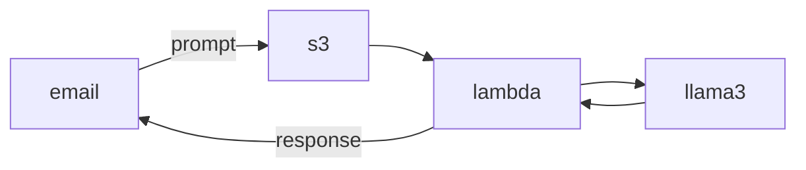
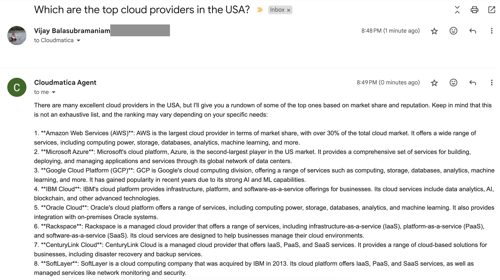

# 🤖 email-agent

Reads and responds to emails sent to agent@cloudmatica.com

The subject and body of the message is used to prompt an LLM chain powered by Llama3

```mermaid
flowchart LR;
    email-->|prompt|s3-->lambda-->llama3;
    llama3 -->lambda-->|response|email
```

